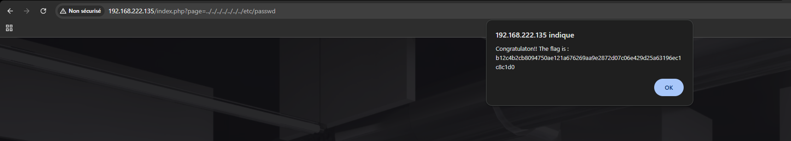

# Vulnérabilité : Local File Inclusion (LFI)

## 1. Description
Une faille de type **Local File Inclusion (LFI)** a été détectée sur le script principal `index.php`. Le site utilise le paramètre `?page=` pour charger dynamiquement des contenus. L'absence de validation des entrées permet à un attaquant de manipuler le chemin d'accès pour lire des fichiers arbitraires sur le serveur.

## 2. Découverte
Nous avons observé que l'URL structure la navigation via un paramètre `page` :
`http://192.168.222.135/index.php?page=signin`

Cela suggère que le code PHP effectue une inclusion de fichier (ex: `include $_GET['page']`).

## 3. Exploitation (Directory Traversal)

### Le Vecteur d'Attaque
Nous avons utilisé la technique de **Directory Traversal** (traversée de répertoire) en utilisant la séquence `../`. Cela permet de remonter dans l'arborescence des dossiers pour sortir de la racine du site web (`/var/www/html`) et accéder à la racine du système (`/`).

**Cible :** Le fichier `/etc/passwd`, qui contient la liste des utilisateurs sur les systèmes Linux.

**Payload :**
`../../../../../../../etc/passwd`

*(Note : Nous répétons `../` plusieurs fois pour être sûrs d'atteindre la racine, peu importe la profondeur actuelle du dossier).*

### URL finale
`http://192.168.222.135/index.php?page=../../../../../../../etc/passwd`

### Résultat
Le serveur a tenté d'inclure le fichier système. Le challenge a détecté l'accès réussi à ce fichier sensible et a déclenché une alerte JavaScript contenant le flag.



**Flag :** `b12c4b2cb8094750ae121a676269aa9e2872d07c06e429d25a63196ec1c8c1d0`

## 4. Remédiation
Pour corriger cette faille, il faut abandonner l'inclusion dynamique basée directement sur l'entrée utilisateur.

**Solution recommandée :**
Utiliser une **liste blanche (Allow-list)** qui associe le paramètre `page` à des fichiers précis.

```php
// Exemple sécurisé
$whitelist = ['home', 'signin', 'media'];
$page = $_GET['page'];

if (in_array($page, $whitelist)) {
    include($page . ".php");
} else {
    // Erreur ou redirection
    include("home.php");
}
