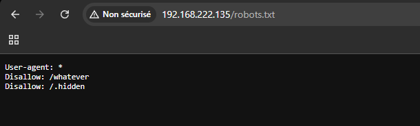
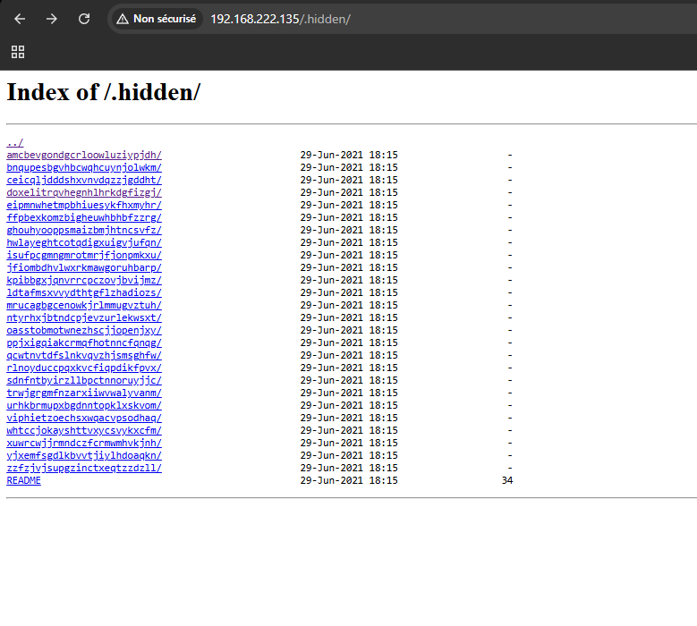
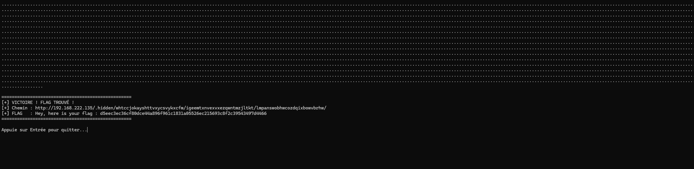

# Challenge : Robots & Hidden Files (Security by Obscurity)

## 1. Reconnaissance
L'exploration du fichier `robots.txt` a révélé l'existence d'un dossier caché qui ne doit pas être indexé par les moteurs de recherche.

* **URL :** `http://192.168.222.135/robots.txt`
* **Règle :** `Disallow: /.hidden`

En accédant au dossier `/.hidden/`, nous avons découvert une structure massive contenant des dizaines de dossiers aux noms aléatoires.

## 2. Exploitation (Scripting)
Chaque dossier contient un fichier `README`, mais la grande majorité contient des leurres (ex: "Demande à ton voisin de droite"). Il est impossible de vérifier manuellement des centaines de sous-dossiers imbriqués.

Nous avons développé un script **Python (Crawler Récursif)** pour :
1. Parcourir l'arborescence complète (dossiers et sous-dossiers).
2. Lire chaque fichier `README`.
3. Filtrer les faux messages pour isoler le Flag.

### Script utilisé
Voir le fichier `solution.py` pour le code source complet.

### Résultat
Le script a identifié le flag après avoir parcouru l'arborescence profonde.

**Chemin découvert :**
`/.hidden/whtccjokayshttvxycsvykxcfm/igeemtxnvexvxezqwntmzjltkt/lmpanswobhwcozdqixbowvbrhw/README`

**Flag :** `d5eec3ec36cf80dce44a896f961c1831a05526ec215693c8f2c39543497d4466`

## 3. Remédiation
Ce challenge illustre pourquoi la "Sécurité par l'obscurité" (Security through obscurity) est une mauvaise pratique.
1. **Robots.txt est public :** Il ne doit jamais être utilisé pour cacher des dossiers sensibles, car c'est le premier endroit que regardent les attaquants.
2. **L'obscurité ne suffit pas :** Même avec des noms de dossiers complexes, un script simple peut cartographier l'intégralité d'un site en quelques secondes.
3. **Contrôle d'accès :** Les données sensibles doivent être protégées par une authentification (mot de passe, htaccess), et non simplement cachées.
