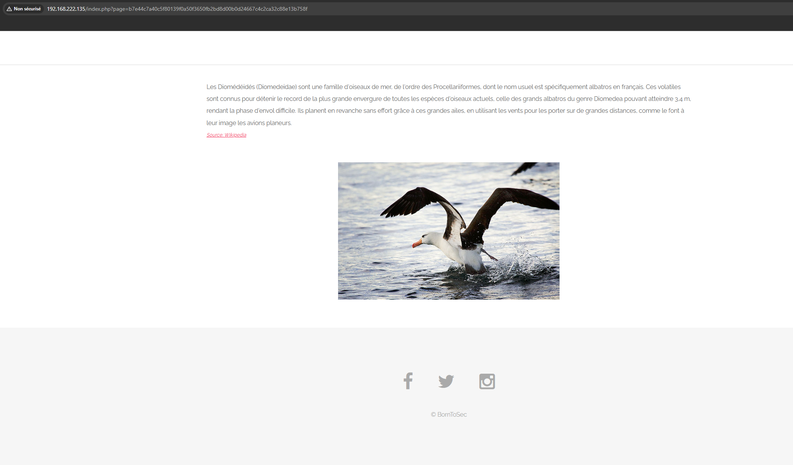
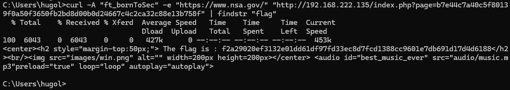

# Vulnérabilité : Security Misconfiguration (User-Agent & Referer)

## 1. Découverte (Reconnaissance)
En bas de la page d'accueil, le lien sur le copyright "&copy; BornToSec" redirige vers une page spécifique.

**URL :** `index.php?page=b7e44c7a40c5f80139f0a50f3650fb2bd8d00b0d24667c4c2ca32c88e13b758f`

Lorsqu'on visite cette page avec un navigateur standard, elle affiche un article générique sur les Albatros (Diomedeidae) sans aucune information sensible apparente.



Cependant, l'analyse des indices (ou du code source/en-têtes) suggère que le contenu change selon l'identité du visiteur (User-Agent) et sa provenance (Referer).

## 2. Exploitation (Spoofing)
Nous avons utilisé `curl` pour modifier les en-têtes HTTP et simuler une requête provenant de la NSA avec un navigateur spécifique au challenge.

**Critères injectés :**
* **User-Agent** : `ft_bornToSec`
* **Referer** : `https://www.nsa.gov/`

### Commande exécutée
```bash
curl -A "ft_bornToSec" -e "[https://www.nsa.gov/](https://www.nsa.gov/)" "[http://192.168.222.135/index.php?page=b7e44c7a40c5f80139f0a50f3650fb2bd8d00b0d24667c4c2ca32c88e13b758f](http://192.168.222.135/index.php?page=b7e44c7a40c5f80139f0a50f3650fb2bd8d00b0d24667c4c2ca32c88e13b758f)" | findstr "flag"
```

